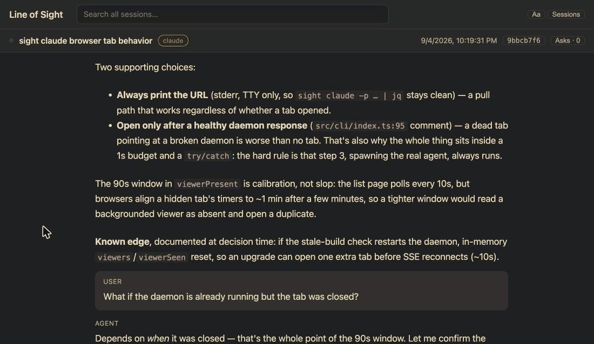

# Line of Sight

Your Claude Code and Codex sessions as a local web page you can actually read.
Select any line and ask about it. The answer comes from a second, read-only run
of your own CLI, so the agent's context stays untouched.

<!-- TODO(#11): docs/demo.gif — select a line, ask, answer streams in -->


```sh
npm i -g line-of-sight
sight claude    # instead of `claude` — same terminal, plus a viewer at localhost:4989
sight codex     # same for Codex
```

## Why

The change was cheap to make; knowing what it did is not. The reasoning sits
in terminal scrollback: unsearchable next week, never as memorable as code you
wrote yourself, mangled when you copy it, and off-limits to questions — asking
"why did you do that?" costs the agent the context it is working with. Line of
Sight reads the transcript files the CLI already writes and gives you:

- **Ask.** Select text, ask a question. A separate read-only run of your CLI
  reads the transcript and the repo and answers. The question is anchored to
  that message and kept.
- **Search.** Full text across every session, in any language.
- **Copy.** Any message as Markdown.
- **Read.** Finished turns fold their tool calls away; conclusions stay.
  Subagents open from the task that launched them.

## Guarantees

- **Read-only.** Never writes to your repo, never touches agent state. The
  asking process gets read-only tools, and there is no switch.
- **Local.** Transcripts are read in place. Questions and answers live in
  `~/.sight`. The daemon makes no network calls — a test greps `src/` to keep
  it that way.
- **Quiet.** Never notifies, never pops up. You open it.

## Not

A dashboard, a cost tracker, an orchestrator, a cloud service, an IDE plugin.

## Notes

macOS, Node 20+, `claude` and/or `codex` on your PATH. Linux untested.
`sight claude` passes every argument through; if the viewer is broken, the
agent still runs. Transcript formats are undocumented and change between CLI
versions: unknown entries render raw, never crash. `sight inspect <transcript.jsonl>`
shows how a line parsed — attach that to a bug report. `sight open` shows the
viewer without starting an agent; `sight stop` kills the background daemon,
and the next `sight` command starts it again. Config in `~/.sight/config.json`
(`responder`, `responderModel`, `responderEffort`); `SIGHT_PORT` for the port.

MIT
